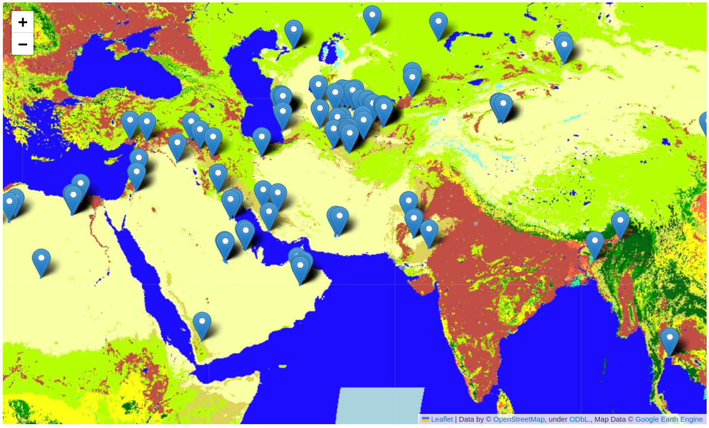

# Satellite_Imagery


## About EMIT
NASA's Earth Surface Mineral Dust Source Investigation (EMIT) is an innovative mission aimed at detecting and analyzing methane plumes on a global scale. Methane, a potent greenhouse gas, contributes significantly to climate change. By utilizing advanced remote sensing technologies, EMIT can identify and monitor methane emissions from various sources, such as natural gas facilities, landfills, and agriculture. This crucial data enables scientists to better understand the dynamics of methane emissions, develop strategies for mitigation, and assess the effectiveness of current policies. The EMIT mission exemplifies NASA's ongoing commitment to leveraging cutting-edge technology to address pressing environmental challenges and safeguard our planet's future.

## Download EMIT methane metadata
Download GeoJSON EMIT Methane Metadata from https://earth.jpl.nasa.gov/emit/data/data-portal/Greenhouse-Gases/

## I. Install and run

- Requirements: Python >= 3.8
- Recommended: Miniconda/Anaconda <https://docs.conda.io/en/latest/miniconda.html>

- Clone Repository:

```
git clone https://github.com/OmkarThawakar/Satellite_Imagery
```

- Create environment:

```
conda env create -f ee.yml
conda activate ee
```

## Display Methane Plumes in Folium
Refer notebook:EMIT_Methane_Plumes.ipynb 


## Display Methane Plumes Over Land Cover Map from Earth Engine in Folium
Refer notebook:EMIT_Methane_Plumes-over_land_cover_using earth_engine.ipynb 



